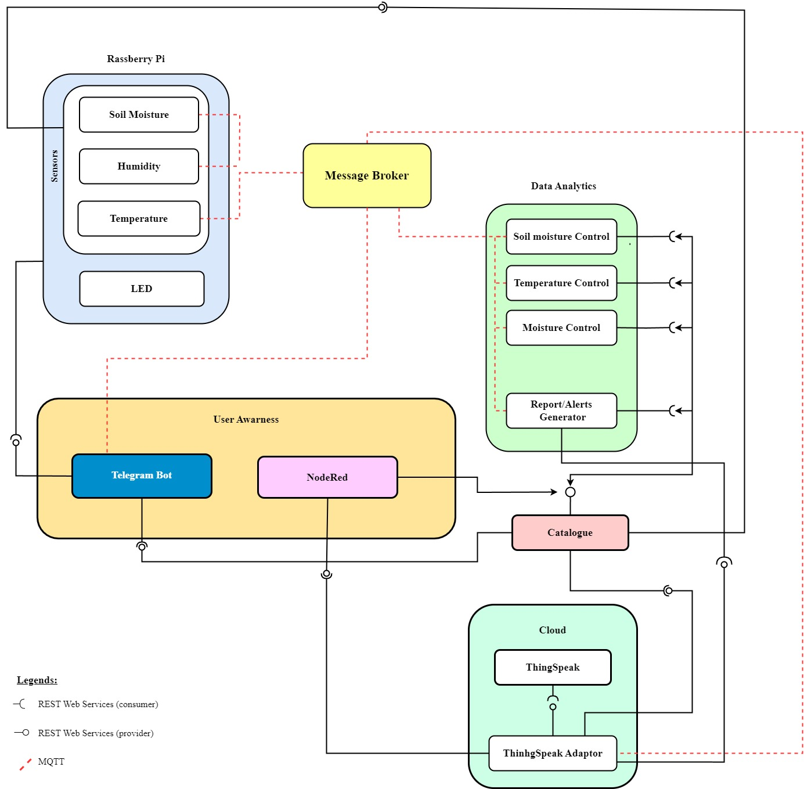

# Smart Plant Care System

Project for the course Programming for IoT Applications at Politecnico di Torino, academic year 2023-2024.

## Overview

The Smart Plant Care System is a modular, microservices-based IoT solution for automating and optimizing plant care. It leverages sensors, a Raspberry Pi, cloud services, and user interfaces to monitor and manage plant health. The system provides real-time monitoring, automated control, historical analytics, and user notifications via Telegram and dashboards.

## Architecture

The system is composed of several Dockerized microservices, each with a dedicated responsibility:

- **Sensor Service**: Reads real or simulated sensor data (soil moisture, temperature, humidity), publishes to MQTT, and exposes actuator control via REST.
- **Analytics Service**: Subscribes to sensor data, analyzes trends, triggers automated actions, and generates weekly reports.
- **Catalogue Service**: Central registry for plants, users, devices, and services. Manages plant/user assignments and stores plant metadata.
- **Cloud Adapter Service**: Bridges MQTT sensor data to ThingSpeak for historical storage and provides REST endpoints for data retrieval.
- **User Service**: Manages user interactions via a Telegram Bot, handles notifications, and provides web endpoints for plant/user management.
- **MQTT Broker**: Facilitates real-time messaging between services.

All services are orchestrated via Docker Compose.

## Features

- **Automated Monitoring**: Continuous collection of soil moisture, temperature, and humidity.
- **Real-Time Alerts**: Telegram notifications for abnormal conditions or required actions.
- **Automated Actuation**: Remote and automated control of actuators (watering, LEDs) based on analytics.
- **Data Visualization**: Node-RED dashboard for real-time and historical data.
- **Historical Analytics**: Weekly reports and recommendations based on ThingSpeak data.
- **Multi-User Support**: Each user can be assigned specific plants, with personalized notifications and thresholds.
- **RESTful APIs**: Each service exposes APIs for integration and management.

## Microservices & APIs

### Sensor Service (`/services/sensor-service`)
- Publishes sensor data to MQTT (`plant/sensor`).
- Subscribes to actuator commands (`plant/command`).
- REST API:
  - `POST /actuator` — Control actuators (e.g., watering, LED) for a plant.
  - `GET /actuator` — Get current actuator state for a plant.

### Analytics Service (`/services/analytics-service`)
- Subscribes to sensor data, analyzes for threshold violations.
- Publishes actuator commands for automated care.
- REST API:
  - `GET /report/weekly` — Generate and retrieve a weekly plant care report.

### Catalogue Service (`/services/catalogue-service`)
- Central registry for all plants, users, devices, and services.
- REST API (main endpoints):
  - `POST /devices`, `GET /devices`, `GET /devices/<id>`
  - `POST /services`, `GET /services`, `GET /services/<id>`
  - `POST /plants`, `GET /plants`, `GET /plants/<id>`, `PATCH /plants/<id>`
  - `GET /plants/active` — List all active (assigned) plants.
  - `POST /users`, `GET /users`, `POST /users/<id>/activate`
  - Web forms: `/register_plant`, `/register_user`

### Cloud Adapter Service (`/services/cloud-adapter-service`)
- Bridges MQTT sensor data to ThingSpeak for storage.
- REST API:
  - `GET /data` — Latest sensor data (optionally filter by `plant_id`).
  - `GET /thingspeak_data` — Historical data from ThingSpeak.

### User Service (`/services/user-service`)
- Telegram Bot for user notifications and commands.
- REST API:
  - `POST /notify` — Send a notification to a user.
  - `GET,POST /register_plant` — Web form to register a new plant.
  - `GET,POST /assign_plant` — Web form to assign a plant to a user.

## User Interfaces

- **Telegram Bot**: Receive alerts, request status, control actuators, and get recommendations.
- **Node-RED Dashboard**: Visualize real-time and historical plant data.
- **Web Forms**: For plant/user registration and assignment (via User and Catalogue services).

## Data Flow

1. **Sensors** (real or simulated) → Sensor Service → MQTT Broker
2. **Cloud Adapter Service** subscribes to MQTT, stores data in ThingSpeak, exposes REST API.
3. **Analytics Service** subscribes to MQTT, analyzes data, triggers actuators if needed, generates reports.
4. **User Service** notifies users via Telegram and web.
5. **Catalogue Service** manages metadata and assignments.

## Hardware Requirements

- Raspberry Pi 3 B (or compatible)
- Soil Moisture Sensor
- DHT11 Sensor (Temperature & Humidity)
- LEDs for status indication
- Breadboard, jumper wires, power supply

## Software Requirements

- Docker & Docker Compose
- Python 3.7+ (for development)
- ThingSpeak account (for cloud storage)
- Telegram Bot token

## Quick Start

1. Clone the repository.
2. Configure `shared/config/global_config.yaml` with your credentials.
3. Run `docker-compose up --build` to start all services.
4. Register your Telegram Bot and add the token to the config.
5. Access the Node-RED dashboard and web forms as needed.

## Extensibility

- Add new plant types and thresholds in `catalogue-service/home_plants_database.json`.
- Extend analytics or notification logic in the respective services.
- Integrate additional sensors or actuators by updating the Sensor Service.

## License

MIT License

