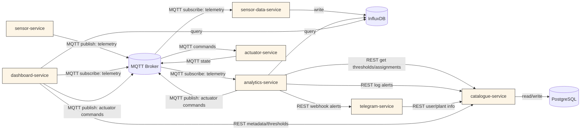

# Smart Plant Care System - Complete Architecture

## System Overview

The Smart Plant Care System is a comprehensive IoT platform for monitoring and automatically caring for plants. It features real-time sensor monitoring, automated watering, alert notifications, a modern web dashboard, and a Telegram bot for user interaction.

## Architecture Diagram



## Services Overview

### Core Services

1. **sensor-service**: Collects sensor data (temperature, humidity, soil moisture) and publishes to MQTT
2. **sensor-data-service**: Subscribes to sensor data and stores it in InfluxDB
3. **analytics-service**: Processes sensor data, applies rules, generates alerts, and controls actuators
4. **catalogue-service**: Manages metadata (plants, users, thresholds, alerts) in PostgreSQL
5. **actuator-service**: Handles hardware control commands (watering, lighting, fans)

### User Services

6. **dashboard-service**: Modern web interface for monitoring and controlling plants
7. **telegram-service**: Telegram bot for user interaction and notifications

### Infrastructure

8. **mqtt-broker**: Message broker for real-time communication
9. **influxdb**: Time-series database for sensor data
10. **postgres**: Relational database for metadata

## Data Flow

### 1. Sensor Data Collection
- `sensor-service` reads from sensors (real or simulated)
- Publishes telemetry data to MQTT topic: `smartplant/{plant_id}/telemetry`
- Data includes: plant_id, sensor type, value, timestamp

### 2. Data Storage
- `sensor-data-service` subscribes to telemetry topics
- Stores data in InfluxDB with tags: plant_id, sensor
- Enables historical analysis and trending

### 3. Analytics & Rules Engine
- `analytics-service` subscribes to telemetry data
- Queries thresholds from `catalogue-service`
- Applies hysteresis-based rules to detect alerts
- Publishes actuator commands to MQTT
- Logs alerts to `catalogue-service`
- Sends webhook notifications to `telegram-service`

### 4. Actuator Control
- `actuator-service` subscribes to actuator command topics
- Executes hardware control (watering, lighting, fans)
- Publishes status updates back to MQTT

### 5. User Interfaces
- **Web Dashboard**: Real-time monitoring, plant management, threshold configuration
- **Telegram Bot**: User registration, status queries, manual control

## API Endpoints

### Catalogue Service (Port 8000)
- `GET /health` - Health check
- `GET /plants` - List plants
- `POST /plants` - Create plant
- `GET /users` - List users
- `POST /users` - Create user
- `GET /thresholds` - List thresholds
- `POST /thresholds` - Create threshold
- `GET /alerts` - List alerts
- `POST /alerts` - Create alert
- `GET /services` - List registered services
- `POST /services/register` - Register service
- `POST /webhooks/alert` - Alert webhook

### Dashboard Service (Port 5000)
- `GET /` - Main dashboard
- `GET /plants` - Plant management
- `GET /users` - User management
- `GET /thresholds` - Threshold management
- `GET /alerts` - Alert monitoring
- `POST /api/water_plant` - Water plant
- `POST /api/assign_user` - Assign user to plant

## MQTT Topics

### Telemetry
- `smartplant/{plant_id}/telemetry` - Sensor data

### Commands
- `smartplant/{plant_id}/actuators/water/set` - Watering commands
- `smartplant/{plant_id}/actuators/light/set` - Lighting commands
- `smartplant/{plant_id}/actuators/fan/set` - Fan commands

### Status
- `smartplant/{plant_id}/actuators/{type}/status` - Actuator status

## Database Schema

### PostgreSQL (Metadata)
- **users**: User information and Telegram chat IDs
- **plants**: Plant information (name, type, creation date)
- **thresholds**: Alert thresholds per plant/sensor
- **alerts**: Alert history
- **assignments**: User-plant relationships
- **services**: Service registry

### InfluxDB (Time Series)
- **Measurement**: telemetry
- **Tags**: plant_id, sensor
- **Fields**: value
- **Retention**: 30 days

## Key Features

### 1. Real-time Monitoring
- Live sensor data display
- Historical data visualization
- Alert notifications

### 2. Automated Care
- Threshold-based alerting
- Automatic watering
- Hysteresis to prevent alert flapping

### 3. User Management
- Telegram bot integration
- User-plant assignments
- Multi-user support

### 4. Modern Web Interface
- Responsive dashboard
- Plant management
- Threshold configuration
- Real-time updates

### 5. Scalability
- Microservices architecture
- Containerized deployment
- Service discovery
- Health monitoring

## Getting Started

1. **Prerequisites**
   - Docker and Docker Compose
   - Telegram bot token (optional)

2. **Configuration**
   ```bash
   # Copy environment template
   cp .env.example .env
   
   # Edit configuration
   nano .env
   ```

3. **Deploy**
   ```bash
   docker-compose up -d --build
   ```

4. **Access Services**
   - Dashboard: http://localhost:5000
   - API Documentation: http://localhost:8000/docs
   - InfluxDB: http://localhost:8086

## Environment Variables

```bash
# MQTT
MQTT_HOST=mqtt-broker
MQTT_PORT=1883

# PostgreSQL
POSTGRES_HOST=postgres
POSTGRES_PORT=5432
POSTGRES_USER=admin
POSTGRES_PASSWORD=admin123
POSTGRES_DB=smartplant

# InfluxDB
INFLUXDB_USERNAME=admin
INFLUXDB_PASSWORD=admin123
INFLUXDB_ORG=smartplant
INFLUXDB_BUCKET=telemetry
INFLUXDB_ADMIN_TOKEN=my-token

# Plant Configuration
PLANT_ID=1
MODE=simulate
INTERVAL=5

# Telegram (Optional)
TELEGRAM_BOT_TOKEN=your_bot_token_here
ALLOWED_CHAT_IDS=123456789

# Logging
LOG_LEVEL=INFO
```

## Monitoring & Maintenance

### Health Checks
- All services have built-in health monitoring
- Service registry tracks service status
- Heartbeat mechanism ensures service availability

### Logging
- Centralized logging with configurable levels
- Error tracking and debugging
- Performance monitoring

### Data Management
- Automatic data retention policies
- Database backup strategies
- Service restart policies

This architecture provides a robust, scalable, and maintainable IoT platform for smart plant care with modern web interfaces and comprehensive monitoring capabilities.
